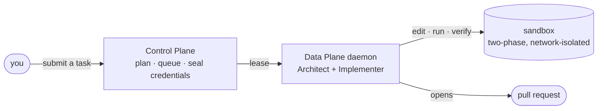

<p align="center">
  
</p>

<h1 align="center">Kiwi</h1>

<p align="center"><b>Kiwi runs coding agents inside infrastructure you control, and shows its work.</b></p>

<p align="center">
  <a href="https://github.com/RunKiwi/kiwi/actions/workflows/ci.yml"></a>
  <a href="https://github.com/RunKiwi/kiwi/actions/workflows/frontend-ci.yml"></a>
  <a href="go.mod"></a>
  <a href="#license"></a>
  <a href="CONTRIBUTING.md"></a>
</p>

<p align="center">
  <a href="https://app.runkiwi.dev"><b>Sign up free →</b></a> ·
  <a href="https://docs.runkiwi.dev">Docs</a> ·
  <a href="#quickstart">Self-host it</a> ·
  <a href="#contributing--context-for-ai">Contributing</a>
</p>

A **Control Plane** admits a task and hands it to a **Data Plane**, which runs a task-long **Architect** that plans and reviews, driving an agentic **Implementer** with real tool calls — reading, grepping and editing the repository, re-running your test command in an isolated sandbox each round until the work is done and verified. Then it opens a PR.

Run it **managed**, where Kiwi operates the execution, or **BYOC**, where the Data Plane runs in your own cloud and neither code nor credentials leave your VPC.

- **Contained.** Model-generated code only ever runs as your test command, in a sandbox with default-deny networking, and never sees an API key. The Architect and Implementer run in the daemon process, not the sandbox.
- **On the record.** Every proposed edit, every review verdict, and every test run is persisted per phase — model, tokens, cost, duration — so a merged diff traces back to what produced it and what proved it.

> [!NOTE]
> **Live, still maturing.** A task flows end to end today: submit one and you get a real PR back. The self-serve **Free tier runs in production** — a signup runs tasks on a Kiwi-operated shared fleet with no setup. Two things are still in build: **Pro** has no self-serve checkout yet (it runs BYOC today, set up by email), and the Firecracker managed-*dedicated* path is written but not deployed. See [Status](#status).

## Contents

[Try it](#try-it) · [Quickstart](#quickstart) · [Architecture](#architecture) · [Features](#features) · [Status](#status) · [Self-hosting](#self-hosting) · [SDKs](#sdks) · [Webhooks](#webhooks) · [Contributing](#contributing--context-for-ai) · [License](#license)

## Try it

**[Sign up or log in at app.runkiwi.dev →](https://app.runkiwi.dev)** is the fastest way to run Kiwi — no setup. Sign in with GitHub or Google, connect a repo, add your own model key, submit a task. Every account starts on the **Free tier**, a Kiwi-operated shared fleet.

Prefer to self-host? See [Quickstart](#quickstart) below.

## Quickstart

One command brings up the whole platform — Control Plane in Docker, plus a Data Plane daemon on your host. Put provider keys in `deploy/.env` and it runs real tasks immediately:

```bash
make local          # Control Plane + daemon; prints the URLs and admin token
make local-down     # stop         (make local-clean wipes the database)
```

Then submit a task via [the CLI](#self-hosting) or the dashboard. `make prod` brings up the full production stack (Postgres + Control Plane + Caddy TLS + containerized daemon) on a single box — see [`deploy/`](deploy/).

## Architecture



- **Control Plane** (`ee/cmd/kiwid`, `ee/orchestrator` — BSL, see [License](#license)) — API, auth, the planner, a Postgres lease queue, sealed credential storage. It never executes your code. → [docs](https://docs.runkiwi.dev/control-plane)
- **Data Plane** (`cmd/kiwidaemon`, `pkg/daemon`) — a pull-model daemon: polls over HTTPS, opens your org's credentials in memory, provisions a workspace, runs the session loop, opens the PR. Outbound connections only, so it sits inside your VPC with no inbound firewall holes. → [docs](https://docs.runkiwi.dev/data-plane)

Full documentation: **[docs.runkiwi.dev](https://docs.runkiwi.dev)**.

## Features

- **Session-driven.** A task-long Architect plans and reviews while an agentic Implementer works the repo with real tools, verified each round in the sandbox until it passes. → [docs](https://docs.runkiwi.dev/session-mode)
- **Plan Mode, opt-in.** Ask Kiwi to stop after the Architect's plan and wait for you before any Implementer round touches your repo. Approve to proceed; reject with feedback and the Architect revises the plan and stops for review again — cancel the job to end the loop outright. Off by default; the session runs straight through otherwise.
- **The test is a guard, not the goal.** Your task description is what Kiwi tries to achieve; the test command only proves nothing broke. A green suite alone isn't "done," and a run that changes no code is reported as a failure.
- **Two-phase, isolated sandbox.** Dependencies install with network and no secrets; verification then runs offline. Model-generated code never has both a network and a credential at once. → [docs](https://docs.runkiwi.dev/sandbox)
- **Zero setup.** No image, test command, or file list required — Kiwi reads what your repo declares and infers the rest, self-correcting a wrong runtime guess before you ever see an error.
- **Sealed credentials.** Your keys are sealed to your daemon's own keypair and opened only in its memory. Cloning happens in the daemon, never in a sandbox. → [docs](https://docs.runkiwi.dev/security)
- **Scoped GitHub access.** Where the GitHub App is installed, tokens are minted per operation, scoped to the repos you picked, valid about an hour, and revocable by you at any time.
- **PR comments continue the task.** Comment `@runkiwi <what to change>` on a Kiwi PR and the same session resumes at its next round, updating that PR instead of opening a new one.
- **Every run is provenance.** Each phase streams live to the dashboard and is assembled into a signed, hash-chained execution record when the job finishes. → [docs](https://docs.runkiwi.dev/execution-record)

## Status

| Area | State |
| :--- | :--- |
| End-to-end seam: submit → plan → sandboxed Architect/Implementer session → PR | ✅ Live |
| **Free tier: live in production** (`app.runkiwi.dev`) — per-org daemon, gVisor sandbox, agent-minute metering & abuse auto-suspend | ✅ Live |
| Session loop — the only execution loop; the single-file loop it replaced has been removed | ✅ Live |
| Plan Mode — opt-in human approve/reject gate before the Implementer runs | ✅ Live |
| GitHub App — per-repo installation tokens minted per operation, `GIT_TOKEN` kept as fallback | ✅ Live |
| Execution record — signed, hash-chained provenance per job | ✅ Live (set `KIWI_VER_SIGNING_KEY`) |
| Dashboard, `kiwi` CLI, Node/Python SDKs, Linear + GitHub webhooks | ✅ Live |
| Fleet-host autoscaling — scale the free-fleet machine to zero when idle | ✅ Live (opt-in) |
| **Pro** (dedicated fleet) — billing wired, self-serve checkout not yet enabled | 🚧 Contact-flow today |
| Managed-**dedicated** — per-org VM Terraform, KMS envelope crypto, Firecracker driver | 🚧 Built; not yet deployed |

<details>
<summary><b>Full history</b> (deep implementation notes, kept for contributors)</summary>

| Area | State |
| :--- | :--- |
| One-command local / single-box prod (`make local` / `make prod`) | ✅ |
| Dashboard: jobs, fleets, models, integrations, activity, settings, metrics | ✅ |
| Multi-file agent: file discovery + multi-file edits | ✅ |
| Provider robustness: key validation on save, quota/error surfacing | ✅ |
| Fleet routing: tasks lease only their fleet's daemons | ✅ |
| Queue diagnostics: a queued task reports *why* it hasn't started | ✅ |
| Job control: stop / retry / delete, with a real abort on the daemon | ✅ |
| Shared context: plan with prior-job learnings (Auto pgvector search / Manual select), org-scoped, opt-in | ✅ |
| Plan validation: reject cyclic/dangling dependencies, duplicate IDs, and undeclared file conflicts at submit time | ✅ |
| Merge provenance: GitHub PR-merge webhook appends a signed `kiwi.ver/merge/v1` link capturing the approver | ✅ Set `GITHUB_WEBHOOK_SECRET` |
| Control plane on GCP: Cloud Run (`kiwi-api`/`kiwi-orchestrator`/`kiwi-frontend`), Cloud SQL, KMS, OAuth sign-in | ✅ Deployed |
| Self-serve signup & tenancy (GitHub/Google OAuth, per-org isolation) | ✅ An org is active on creation — no operator step. `suspended` (abuse auto-suspend) is the only run-path gate |
| Billing: Stripe Checkout for the Pro upgrade + signed webhook (plan/limits) | ✅ Wired (test mode); set `STRIPE_*` env to enable |
| Egress isolation: sandbox `--network none` (enforced + tested) + host metadata-endpoint hardening | ✅ Shipped; apply on the fleet host |
| Tool-calling seam (`provider.ToolRunner`) + persistent sandbox (`sandbox.Session`) + cache-aware pricing | ✅ |
| Crash recovery: round-level checkpoints (`agent_sessions`); a re-leased task resumes at its last finished round | ✅ |
| Cost: prompt caching on by default, cache-priced budgets, mid-round transcript compaction | ✅ |
| Planner collapse: one worker per session job, no LLM call and no credential decryption on the Control Plane | ✅ |
| Provider parity: tool-calling on Anthropic, Gemini and OpenAI | ✅ |
| Partial edits: `edit_file` replaces an exact string instead of rewriting the file whole | ✅ |

</details>

## Self-hosting

<details>
<summary><b>Building from source</b></summary>

`make local` builds and runs everything. To build individual binaries manually, note that newer macOS `dyld` requires external linking and an ad-hoc signature:

```bash
go build -ldflags="-linkmode=external" -o kiwi        cmd/kiwi/main.go        && codesign -s - -f ./kiwi         # CLI
go build -ldflags="-linkmode=external" -o kiwid       ee/cmd/kiwid/main.go       && codesign -s - -f ./kiwid        # Control Plane
go build -ldflags="-linkmode=external" -o kiwidaemon  cmd/kiwidaemon/main.go  && codesign -s - -f ./kiwidaemon   # Data Plane daemon
```

</details>

<details>
<summary><b>Running each piece manually</b> (<code>make local</code> does this for you)</summary>

**1. Control Plane** — requires Postgres; NATS is optional and degrades with a warning if unreachable.

```bash
export KIWI_SERVER_TOKEN="my-secret-token-1234"
./kiwid -addr :8080 -dsn "host=localhost user=postgres password=postgres dbname=kiwi port=5432 sslmode=disable"
```

Flags: `-addr`, `-dsn`, `-role` (`api` | `orchestrator` | `migrate` | `all`), `-nats`. `-role migrate` applies migrations and exits. Health checks: `/healthz`, `/readyz`.

**2. The `kiwi` CLI**

```bash
./kiwi login -token "my-secret-token-1234"                 # stored in ~/.config/kiwi/config.json
./kiwi creds set anthropic "sk-ant-..."                     # or: gemini "AI..." / openai "sk-..."
./kiwi creds set git "github_pat_..."

./kiwi submit -task "Fix the divide-by-zero panic in Divide()" \
    -repo https://github.com/you/yourrepo -ref main \
    -file math_utils.go -test-cmd "go test ./..."

# -architect-model is optional (defaults to -model); worth setting to something
# more capable, since the reviewer runs a handful of times per task while the
# implementer runs constantly.
./kiwi submit -task "Add a Modulo function mirroring Divide, with table-driven tests" \
    -repo https://github.com/you/yourrepo -ref main \
    -file math_utils.go -test-cmd "go test ./..." \
    -model claude-haiku-4-5-20251001 -architect-model claude-sonnet-5

./kiwi submit -resume -task-id <task-id>   # resume an existing task
./kiwi claude                              # launch Claude Code with Kiwi Swarm offloading
```

`kiwi submit` resolves the token from `-token`, then `KIWI_SERVER_TOKEN`, then the saved login config.

**Model routing** — the model catalog is the source of truth; unmatched models fall back to prefix inference:

| Model id | Provider | Credential |
| --- | --- | --- |
| `gemini-*` (e.g. `gemini-flash-latest`) | Gemini | `GEMINI_API_KEY` |
| `gpt-*`, `o1*`, `o3*`, `o4*`, `chatgpt-*` (e.g. `gpt-5-mini`) | OpenAI | `OPENAI_API_KEY` |
| anything else (e.g. `claude-opus-4-8`) | Anthropic | `ANTHROPIC_API_KEY` |

An operator can also fund usage with Kiwi's own keys so users bring nothing:

```bash
KIWI_PLATFORM_OPENROUTER_API_KEY=...   # one key reaches many model families
KIWI_PLATFORM_ANTHROPIC_API_KEY=...
KIWI_PLATFORM_GEMINI_API_KEY=...
KIWI_PLATFORM_OPENAI_API_KEY=...
```

Usage is capped per org per month by a token allowance banded by model price (`free` / `economy` / `frontier`), set in `pkg/entitlement`. These keys are sealed only to daemons Kiwi itself operates — a BYOC fleet never receives one. Full routing, retry and discovery details: → [docs](https://docs.runkiwi.dev/models).

**3. The Data Plane daemon**

```bash
./kiwidaemon -api-url https://api.runkiwi.dev \
    -key-path ~/.kiwi/daemon.key -cache-dir /tmp/kiwi-cache \
    -poll-interval 5s -max-cached-repos 20 -session-budget 5.00 \
    -join-token "$KIWI_JOIN_TOKEN"
```

On first boot the daemon generates its keypairs and registers with a **single-use join token** (mint one with `POST /api/v1/daemon/join-token`, or from the dashboard's Fleets page); its persisted identity key is sufficient after that. Per-task spend is capped by `-session-budget` / `KIWI_SESSION_BUDGET_USD` (default `5.00`); rounds by `-max-rounds`. The git cache keeps at most `-max-cached-repos` bare clones (default 20, `0` disables the bound). Sandbox memory sizes itself from the host (an eighth of RAM, floored at 1 GB, capped at 4 GB); override with `KIWI_SANDBOX_MEMORY`. For the shared Free tier, pass `-sandbox-runtime runsc` so tests run under gVisor. The per-task wall-clock cap comes from the org's plan: **20 minutes on Free**, 30 elsewhere.

**4. Dashboard**

```bash
KIWI_CORS_ALLOWED_ORIGINS=http://localhost:3000 ./kiwid -addr :8080 -dsn "..."
cd frontend && cp .env.local.example .env.local   # set NEXT_PUBLIC_KIWI_API_URL=http://localhost:8080
npm ci && npm run dev                               # http://localhost:3000
```

Product analytics are optional and off by default: set `NEXT_PUBLIC_POSTHOG_KEY` to enable an activation funnel with no repository names, task text, or credentials sent — leave it unset (as any self-hosted deployment should) and no analytics code is even downloaded.

</details>

<details>
<summary><b>Deployment reference</b> (Free-tier substrate, operational env vars)</summary>

**Free-tier deployment.** Split across two substrates, since Cloud Run cannot run the provisioner's `docker run` launches or a gVisor sandbox:

1. **Control plane on Cloud Run** — `kiwi-api`, `kiwi-orchestrator`, `kiwi-frontend`, backed by Cloud SQL. `KIWI_PROVISIONER` is left unset here.
2. **A Docker + gVisor GCE VM** ("free-fleet host") running `KIWI_PROVISIONER=docker`, supervised by the `kiwi-provisioner` systemd unit in [`deploy/free-fleet/`](deploy/free-fleet/). It cold-starts a per-org `kiwidaemon` container on submit, sandboxed under `runsc`. `KIWI_DAEMON_IMAGE` is deliberately left unset — see [`deploy/free-fleet/`](deploy/free-fleet/) for why.
3. The **`kiwidaemon` image**, built with `docker build --target kiwidaemon` (the root `Dockerfile` ships both `kiwid` and `kiwidaemon` targets).

Deploys to this environment are automated on merge to `main` — see [Continuous Deployment](deploy/gcp/control-plane/README.md#continuous-deployment). Schema changes apply via the standard `kiwid -role migrate` job. **Pro** (dedicated) stays on per-org VMs.

**Operational env vars.**

- `production` mode requires `KIWI_ENCRYPTION_KEY`, `KIWI_SERVER_TOKEN`, `KIWI_CORS_ALLOWED_ORIGINS`. For managed, set `KIWI_KMS_KEY` for Cloud KMS envelope encryption.
- `KIWI_VER_SIGNING_KEY` (base64 Ed25519 seed or key) + `KIWI_VER_SIGNING_KEY_ID` sign execution records; generate with `openssl rand -base64 32`. Must be stable and shared across replicas. Unset means records are still assembled but marked `"attestation": "unsigned"`.
- `POST /api/v1/planner/plan` supports idempotent submissions via `Idempotency-Key`.
- Job control: `POST /api/v1/jobs/{id}/cancel|retry`, `DELETE /api/v1/jobs/{id}`.
- `KIWI_FLEET_HOST_{PROJECT,ZONE,INSTANCE}` enables fleet-host autoscaling (`pkg/fleethost`); unset disables it, which is what BYOC and local dev want.
- `KIWI_COMPLETION_MAX_TOKENS` (default 16000) bounds a single completion.
- Migrations apply automatically on boot; in a multi-replica deployment run `kiwid -role migrate` once first and set `KIWI_SKIP_BOOT_MIGRATE=true` on serving roles.

</details>

## SDKs

Minimal v1 SDKs for programmatic submission (CI/CD, Sentry auto-triage) live in `sdk/`, published as [`@runkiwi/sdk`](https://www.npmjs.com/package/@runkiwi/sdk) on npm and [`kiwi-sdk`](https://pypi.org/project/kiwi-sdk/) on PyPI.

```js
// Node (sdk/node): zero dependencies, Node 18+
const { KiwiClient } = require('@runkiwi/sdk');
const client = new KiwiClient('http://localhost:8080', process.env.KIWI_TOKEN);
const { job_id } = await client.submitTask({
  task: 'Fix flaky test', file: 'pkg/foo/foo.go', testCmd: 'go test ./...',
});
const job = await client.getJob(job_id);
```

```python
# Python (sdk/python)
from kiwi import KiwiClient
client = KiwiClient("http://localhost:8080", token)
result = client.submit_task(task="Fix flaky test", file="pkg/foo/foo.go", test_cmd="go test ./...")
job = client.get_job(result["job_id"])
```

Both submit to `/api/v1/planner/plan`; workers run asynchronously, so poll `getJob` / `get_job` for the PR.

## Webhooks

- `POST /api/v1/webhooks/linear` — issues labeled `kiwi` (or moved to **In Progress**) become planner jobs. Requires `LINEAR_WEBHOOK_SECRET`.
- `POST /api/v1/webhooks/github` — on a merged PR, appends a signed `kiwi.ver/merge/v1` link capturing the approver. Requires `GITHUB_WEBHOOK_SECRET`.
- `POST /api/v1/webhooks/github` — a comment on a Kiwi PR continues the task that opened it, guarded by org mode and write access. Every rejection returns 200, so GitHub never disables the hook.
- `POST /api/v1/webhooks/github` — after a Kiwi PR merges, watches for a **merged** revert PR or a failed CI check on the merge commit for 24h and posts a verdict comment. An opened-but-unmerged revert PR is ignored: the merge is the authorization. Revert detection recognizes both a manually authored `git revert` commit message and GitHub's own Revert-button body (`Reverts #N`), resolving the latter via a GitHub API call scoped to the reverting PR's own repository. A REGRESSION verdict can auto-open a fix task if the org has `auto_remediate` enabled. Requires the GitHub App to also subscribe to `check_run` events (configured in the App's settings, not in this repo); orgs with a Datadog or Prometheus credential and a `telemetry_metrics` entry provisioned for the repo (configured via the dashboard's Metrics page) also get an early REGRESSION verdict from a significant metric regression, checked every 15 minutes for up to 4 hours post-merge (the comparison window grows from the merge point, so the first cycles read inconclusive until it is wide enough to be significant) — a clean telemetry read alone never finalizes VERIFIED early, only the window-elapsed sweep does. An org with a `SLACK_WEBHOOK_URL` credential also gets every verdict (VERIFIED or REGRESSION) posted to Slack, best-effort alongside the PR comment; the webhook URL is fetched and posted entirely on the Control Plane side and is excluded from the sandbox test-command environment the same way LLM and telemetry credentials are.
- A monitor can also be created on **any merged PR**, not only one Kiwi opened — from the dashboard's Monitors page (paste a PR URL) or by commenting `@runkiwi monitor this` on the PR itself, guarded by the org's PR-comment mode and the commenter's write access, same as any other comment-driven instruction. Such a monitor gets the same GitHub-native and telemetry regression detection and the same notification as a Kiwi-authored one, but never auto-remediation: there is no originating Kiwi session to resume a fix from, enforced structurally by an empty `job_id` rather than a UI-level restriction.
- `POST /api/v1/webhooks/slack` — `@mention` Kiwi in a Slack channel to trigger planner tasks or investigate issues directly from Slack. Connect via **Add to Slack** under **Integrations**, bind channels to repositories on the **Slack Channel Bindings** page (`/integrations/slack`), or specify a target repo inline with `repo:owner/name`. A binding can also pin a default test command (or override inline with `test:"..."`) and a default worker/architect model — unconfigured, Kiwi picks the cheapest available Kiwi-funded model at run time instead. Kiwi reacts with `:eyes:` on trigger, updates a live status message as the job runs, and reports either the opened pull request or investigation findings upon completion. Replies in an already-actioned thread are classified to continue the task, fork into a new task, or ask for clarification. If an investigation prompt asks to create/file a GitHub issue, Kiwi opens the issue directly upon completion. Requires `SLACK_CLIENT_ID`, `SLACK_CLIENT_SECRET`, and `SLACK_SIGNING_SECRET`.

## Contributing & context for AI

For build/test conventions, the PR checklist, and instructions for AI assistants, see [CLAUDE.md](CLAUDE.md). Contributions are accepted under the [DCO](CONTRIBUTING.md).

Every PR modifying the codebase must keep this README current. If no update is needed, add the `skip-readme-check` label to the PR.

## License

Kiwi is open core. Two licences, split along one line: **the Data Plane and the engine are Apache-2.0; the multi-tenant Control Plane is not.**

| | Licence | What it covers |
| --- | --- | --- |
| Everything outside `ee/` | [Apache 2.0](LICENSE) | `kiwidaemon`, `kiwi`, `kiwi-agent`, the Architect/Implementer session loop, the sandbox, the provider clients, the execution record, model discovery, the store |
| `ee/` | [BSL 1.1](ee/LICENSE) | The Control Plane: `kiwid`, orchestration, planning, orgs and auth, billing, entitlements, provisioning, fleet control |

**If you run Kiwi in your own cloud, the part you run is Apache-2.0.** `cmd/kiwidaemon` — the daemon that clones your repo, runs the loop, and executes your tests — depends on nothing under `ee/`, enforced by a test (`pkg/licensing_boundary_test.go`), not by convention.

The BSL permits reading, modifying, and running the Control Plane, including in production for your own organisation's work — what it does not permit is offering it to third parties as a hosted service. Each version converts to Apache-2.0 four years after publication.

Copyright © 2026 RunKiwi.
